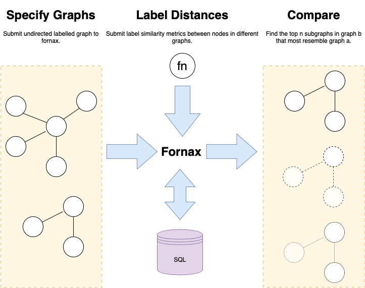

[](https://circleci.com/gh/digicatapult/fornax)
[](https://coveralls.io/github/digicatapult/fornax?branch=master)
[](https://snyk.io/test/github/digicatapult/fornax/badge.svg)
[](https://fornax.readthedocs.io/en/latest/?badge=latest)

# Fornax

An implementation of [NeMa: Fast Graph Search with Label Similarity](http://www.vldb.org/pvldb/vol6/p181-khan.pdf) using python3 and sqlite or postgres.



## Install (Dev)

From the root directory:

```bash
# install dev dependencies
pip install -r requirements/dev.txt

# install fornax
pip install -e .
``` 

## View the Docs

View the docs at: [fornax.readthedocs.io](http://fornax.readthedocs.io/)

## Test

From the root directory

```bash
python run_test.py
```

Fornax requires numpy to be installed (part of the SciPy ecosystem). 
The available options for installing SciPy packages are listed [here](https://scipy.org/install.html).

## Tutorials

See the tutorials for a full working example.

* [Part 1](docs/tutorial/tutorial1.ipynb) - Download a small graph dataset
* [Part 2](docs/tutorial/tutorial2.ipynb) - Search the dataset using fornax

### Install Tutorial Dependencies (using conda)

The following tutorials use jupyter notebooks to create a worked example.
We recommend you use the anaconda python distribution to run the notebooks.

```bash
conda env create -f environment.yml
```

### Run the Tutorials

```bash
source activate fornax_tutorial
cd docs/tutorial
jupyter-notebook
```

## Documentation

### Build the Docs

```bash
# install docs dependencies
pip install -r requirements/docs.txt
# install fornax
pip install .

# build
cd docs
make html
```

### View the Docs Locally

```bash
cd _build/html
python3 -m http.server
```

navigate to `0.0.0.0:8000` in your browser.
