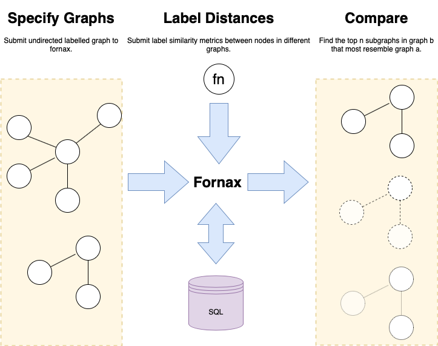

[](https://circleci.com/gh/CDECatapult/fornax)
[](https://coveralls.io/github/CDECatapult/fornax?branch=master)

# Fornax

An implementation of [NeMa: Fast Graph Search with Label Similarity](http://www.vldb.org/pvldb/vol6/p181-khan.pdf) using python3 and sqlite or postgres.



## Install (Dev)

From the root directory:

```bash
pip install -r requirements/dev.txt
``` 

## Test

From the root directory

```bash
python run_test.py
```

Fornax requires numpy to be installed (part of the SciPy ecosystem). 
The available options for installing SciPy packages are listed [here](https://scipy.org/install.html).

## Tutorials

See the tutorials for a full working example.

### Tutorial Dependencies

The following tutorials use jupyter notebooks to create a worked example.
We reccomend you use the anaconda python distribution to run the notebooks.

```bash
conda env create -f environment.yml
pip install -r requirements.txt
```

* [Part 1](https://github.com/CDECatapult/fornax/blob/master/notebooks/tutorial/Tutorial%201%20-%20Creating%20a%20Dataset.ipynb) - Download a small graph dataset 
* [Part 2](https://github.com/CDECatapult/fornax/blob/master/notebooks/tutorial/Tutorial%202%20-%20Making%20a%20Query.ipynb) - Search the dataset using fornax

## Database Setup

By default fornax will use an in memory SQlite database.

Alternative databases can be used by setting the environment variable `FORNAX_DB_URL` using the [sqlalchemy database url format](https://docs.sqlalchemy.org/en/latest/core/engines.html).
SQLite and Postgresql are supported although other databases are untested.

All tables and indicies are initialised at import time if they do not exist already.

## Quick start

```python
# create a query graph
query_graph_handle = fornax.GraphHandle.create()
query_graph_handle.add_nodes(id_src=[0, 1, 2], label=['Hulk', 'Lady', 'Storm'])
query_graph_handle.add_edges([0, 1], [1, 2])


# create a target graph
target_graph_handle = fornax.GraphHandle.create()
target_graph_handle.add_nodes(id_src=comic_book_nodes['id], label=comic_book_nodes['name'])
target_graph_handle.add_edges(comic_book_edges['start'], comic_book_edges['end'])

matches = [
    (query_node_id, target_node_id, weight) 
    for query_node_id, target_node_id, weight 
    in string_similarities
]

match_starts, match_ends, weights = zip(*matches)

# stage a query
query = fornax.QueryHandle.create(query_graph_handle, target_graph_handle)
query.add_matches(match_starts, match_ends, weights)

# go!
query.execute()
```

```json
{
    "graphs": [
        {
            "cost": 0.024416640711327393,
            "nodes": [
                {
                    "id": 9437002,
                    "type": "query",
                    "id_src": 0,
                    "label": "hulk"
                },
                {
                    "id": 13982314,
                    "type": "query",
                    "id_src": 1,
                    "label": "lady"
                },
                {
                    "id": 76350203,
                    "type": "query",
                    "id_src": 2,
                    "label": "storm"
                },
                {
                    "id": 75367743,
                    "type": "target",
                    "id_src": 37644418,
                    "label": " Susan Storm",
                    "type_": 2
                },
                {
                    "id": 5878004,
                    "type": "target",
                    "id_src": 995920086,
                    "label": "Lady Liberators",
                    "type_": 1
                },
                {
                    "id": 71379958,
                    "type": "target",
                    "id_src": 2142361735,
                    "label": "She-Hulk",
                    "type_": 0
                }
            ],
            "links": [
                {
                    "start": 9437002,
                    "end": 71379958,
                    "type": "match",
                    "weight": 0.9869624795392156
                },
                {
                    "start": 13982314,
                    "end": 5878004,
                    "type": "match",
                    "weight": 0.9746778514236212
                },
                {
                    "start": 76350203,
                    "end": 75367743,
                    "type": "match",
                    "weight": 0.9651097469031811
                },
                {
                    "start": 9437002,
                    "end": 13982314,
                    "type": "query",
                    "weight": 1.0
                },
                {
                    "start": 13982314,
                    "end": 76350203,
                    "type": "query",
                    "weight": 1.0
                },
                {
                    "start": 5878004,
                    "end": 71379958,
                    "type": "target",
                    "weight": 1.0
                }
            ]
        }
    ],
    "iters": 2,
    "hopping_distance": 2,
    "max_iters": 10
}
```
